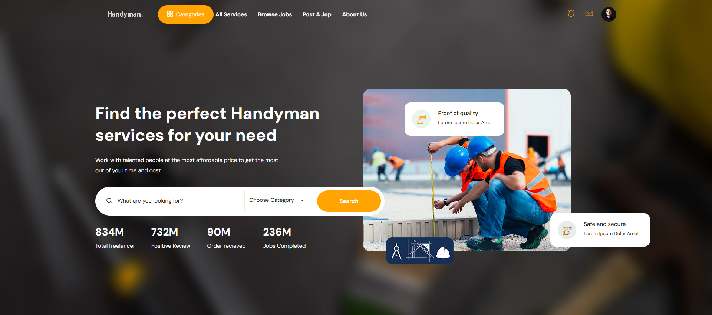
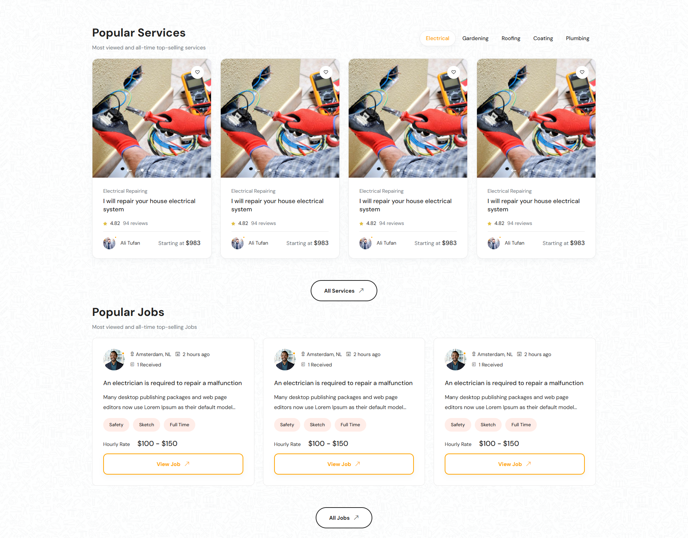
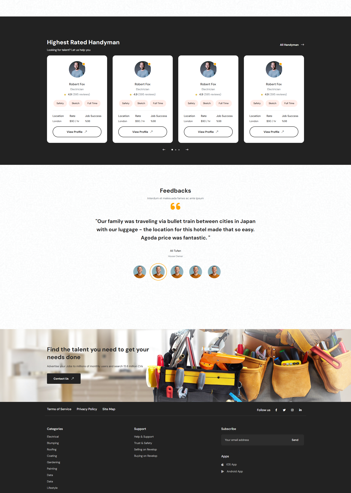
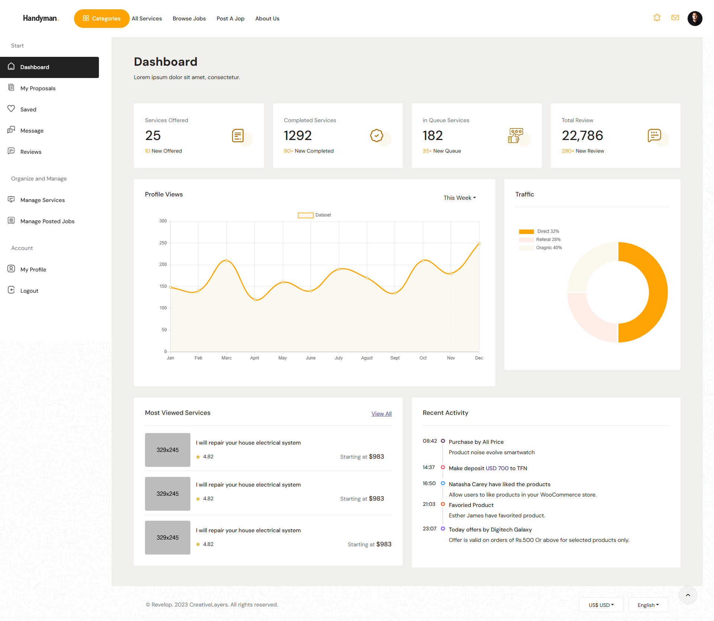

# 🛠 Etfarag

 Handyman Website - Skilled Labor Platform in the Netherlands

## 🌐 Live Demo

Check out the live demo of the project here:  
[Handyman Live Demo](https://handyman-nl.vercel.app/)

---

## 🌟 **Features**
- ✅ Feature 1: Responsive Design: The website adapts beautifully across all devices.
- ✅ Feature 2: Clear UI: User-friendly navigation and clean design.
- ✅ Feature 3: Dashboard

---

## 📸 **Screenshots**
Screenshots showcasing the website interface or key features:

- **Homepage:**
  
  

- **Dashboard:**
  

---

## 🛠️ **Technologies Used**
- HTML
- CSS
- JavaScript
- Bootstrap

